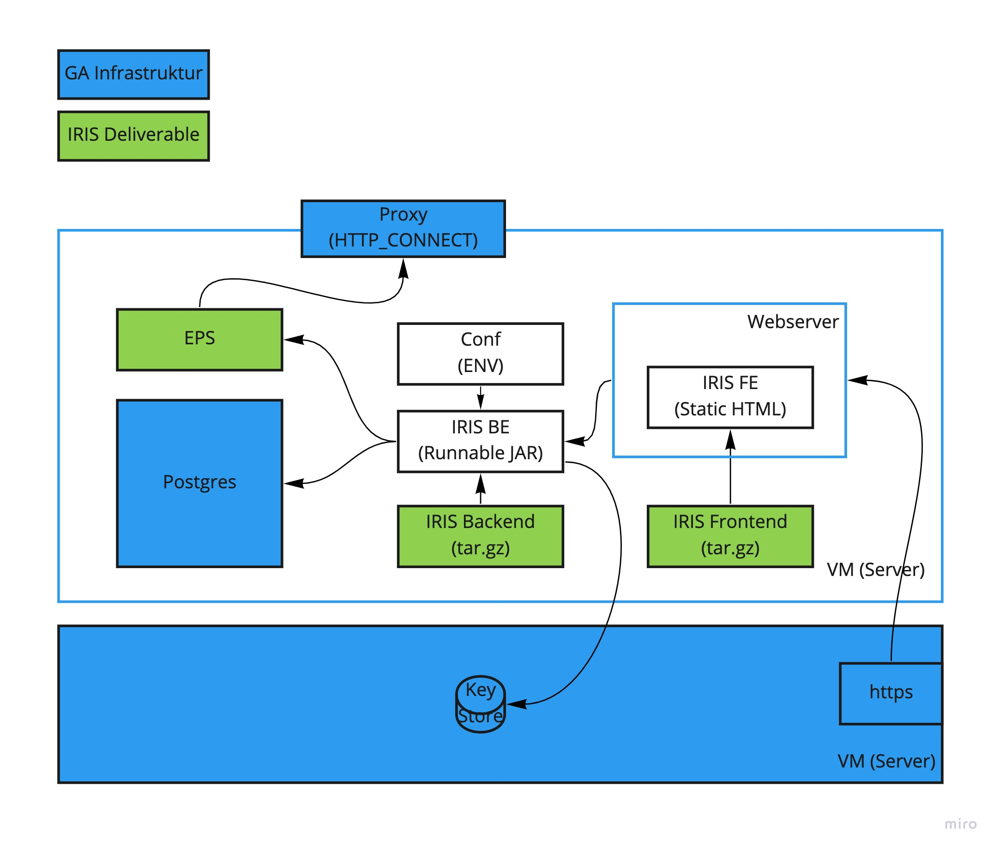

# IRIS Client

Der IRIS Client ist der Teil vom IRIS Ecosystem, der auf einem Server im Gesundheitsamt (bzw. beim IT Dienstleiser) installiert wird und die Kernfunktionalitäten für Endbenutzer zur Verfügung stellt. 

## Systemvoraussetzungen

Für den Betrieb des IRIS Clients empfehlen wir folgende Dimension:

```
VM mit 2 vCores, 16 GB Ram und 20 GB Storage
```

## IRIS Client Komponenten

Folgende Komponenten werden vom IRIS Team bereit gestellt. 

| Komponente | Beschreibung | Technologie |
|-|-|-|
| IRIS Client Frontend | Statische Web-Anwendung (Single Page Application) | [Typescript](https://www.typescriptlang.org/), [Vue.js](https://vuejs.org/), [Vuetify](https://vuetifyjs.com/en/) |
| IRIS Client Backend | Backend Komponente für die Webanwendung. Kümmert sich um Authentifizierung und Authorisierung, stellte die gesicherte Verbindung zu den zentralen und de-zentralen IRIS Servicen bereit. | Java, [Spring Boot](https://spring.io/projects/spring-boot) |
| EPS | Endpunktserver für den Punkt-zu-Punkt Datenübertragung der Gästelisten und Kontakttagebüchern (https://github.com/iris-gateway/eps) | [Go](https://golang.org/) |

Folgende Laufzeit-Abhängigkeiten werden vom IRIS Client vorausgesetzt. 

| Laufzeit-Abhängigkeit | Beschreibung  |
|-|-|
| Postgres DB | Das IRIS Client Backend benutzt eine Postgres Datenbank für die a) Verwaltung der Benutzer und b) für die Speicherung der offenen Index Fall Anfragen und Ereignis Anfragen |
| Webserver | Für die Bereistellung des IRIS Client Frontend über eine sichere HTTPS Verbindung wird ein Webserver benötigt. Dieser muss in der Lage sein a) Die statische Webanwendung auszuliefern und b) Anfragen an die API an das Backend weiterzuleiten |
| Proxy Server | In vielen GAs werden ausgehende Verbindungen über einen Proxy Server geroutet. Der IRIS Client stellt eine Konfigurationsmöglichkeit dafür zur Verfügung. |

> Die Standard-Installationsvariante mit Docker Compose bringt bereits ein vorkonfiguriertes Setup inklusive der Postgres DB, dem Webserver (nginx) und EPS mit. 

Desweiteren werden folgende Konfigurations-Abhängikeiten benötigt. 

| Konfigurations-Abhängigkeit | Beschreibung  |
|-|-|
| Domain | Die vom GA anhängige Domain unter der der IRIS Client für die Benutzer erreichbar ist (z.B. iris.bonn.local) |
| Domain Zertifikat und Schlüssel | Für die o.g. Domain muss ein valides Zertifikat inklusive privatem Schlüssel bereitgestellt werden. |
| GA Client Zertifikat | Der IRIS Client benutzt ein für das GA ausgestelltes Client Zertifikat um mit den zentralen IRIS Servicen zu kommunizieren. Darüber hinaus werden alle Anfragen die vom IRIS Client ausgehen mit dem Zertifikat signiert. |

Desweiteren gibt es folgende infrastrukturelle Anhängigkeiten

| Infrastruktur-Abhängigkeit | Beschreibung  |
|-|-|
| HTTPS Proxy | Proxy server für EPS. Unterstützung für [HTTP_CONNECT](https://developer.mozilla.org/en-US/docs/Web/HTTP/Methods/CONNECT) notwendig.  |
| Proxy Freischaltung - IRIS Central Services - Staging | Zugriff auf iris.staging.iris-gateway.de (ConnectPorts: 3322, 4445, 5559)  |
| Proxy Freischaltung - IRIS App Provider - Staging (ConnectPorts: 4444) | Zugriff auf *.apps.staging.iris-gateway.de  |
| Proxy Freischaltung - IRIS Central Services - Live | - (TBD) |
| Proxy Freischaltung - IRIS App Provider - Live | - (TBD) |


## Authentifizierung und Authorisierung

Aktuell bietet der IRIS client eine eigene Benutzerverwaltung an, die von einem IT Administrator betreut werden muss. 


## IRIS Client - Installation Stand-Alone

Für diese Installationsart werden alle Komponenten des IRIS Clients separat auf einem Server installiert. Das folgende Schaubild visualisiert das Setup. 




### Installation IRIS Backend (IRIS BE)

Bei dem IRIS Backend handelt es sich um eine Java Applikation (min Java 11). 

1) Download Jar Datei

    ```
    https://github.com/iris-gateway/iris-client/releases
    ```

2) Anlegen einer Konfigurations Datei (Beispielwerte)

    ```
    > touch conf.env
    export SPRING_PROFILES_ACTIVE=prod

    export SPRING_DATASOURCE_USERNAME=iris
    export SPRING_DATASOURCE_PASSWORD=iris
    export SPRING_DATASOURCE_URL=jdbc:postgresql://localhost:5432/iris

    # Needs to be kept for now for compatibility reasons
    export IRIS_SERVER_ADDRESS=api.staging.iris-gateway.de
    export IRIS_SERVER_PORT=443

    export SECURITY_JWT_JWT_SHARED_SECRET=foobar

    export SECURITY_AUTH_DB_ADMIN_USER_NAME=admin
    export SECURITY_AUTH_DB_ADMIN_USER_PASSWORD=admin
    ```
3) Konfigurations Parameter als Umgebungsvariablen exportieren

    ```
    source conf.env
    ```
4) Starten der Java Applikation (Beispiel Version: v1.0.3-alpha)

    ```
    java -jar iris-client-bff-v1.0.3-alpha.jar
    ```
## IRIS Client - Installation mit Docker Compose

Für diese Installationsart wird der IRIS Client in einer [Docker](https://docker.io) Umgebung gestartet. Die notwendigen Images werden vom [INÖG Vereichnis im Dockerhub](https://hub.docker.com/u/inoeg) heruntergeladen. 

### Installation Docker und Docker compose

Bevor man mit der Installation des IRIS Clients beginnen kann, muss man die Docker Umgebung Installieren. Die Art der Installation ist abhängig vom jeweiligen Betriebssystem des Servers.

#### Linux Ubuntu

1) Installation der Docker Engine ist [hier beschrieben](https://docs.docker.com/engine/install/ubuntu/).

2) Installation von Docker Compose ist [hier beschrieben](https://docs.docker.com/compose/install/#install-compose-on-linux-systems).

#### Microsoft Windows 10

1) Installation eines »Windows Subsystem für Linux« (WSL), da die Docker Engine ein unix-artiges Betriebssystem verlangt. [hier beschrieben](https://docs.microsoft.com/en-us/windows/wsl/install-win10). Gegenwärtig wurde die Linux-Distribution »Ubuntu 20.04 LTS« erprobt.

2) »Windows Subsystem für Linux« starten. Es gibt dafür eine Desktop-App. Erweitere Rechte (Starten als Administrator) sind nicht erforderlich.

3) Installation »Docker Desktop für Windows«, Desktop-Applikation, die alle Werkzeuge (Docker Engine, Docker Compose) mitbringt, um Docker auf Windows zu betreiben. [hier beschrieben](https://docs.docker.com/docker-for-windows/install/)

4) »Docker Desktop für Windows« starten - auch OHNE Administrator-Rolle möglich.

### Installation IRIS Client


1) Auspacken des Installations Archives

    ```
    unzip iris-client.zip
    ```

1) Eine Kopie von .env.sample erstellen

    ```
    cp .env.sample .env
    ```

1) Konfigurations Parameter anpassen

    ```
    .env öffnen und bearbeiten (siehe Konfiguration IRIS Client)
    ```

1) IRIS Client mit Docker Compose und interner Postgres starten.

    ```
    docker-compose up -d
    ```

1) IRIS Client mit Docker Compose und externer Postgres starten.

    ```
    docker-compose -f docker-compose-ext-postgres.yml up -d
    ```


3) Überprüfen ob alle services laufen

    ```
    # embedded Postgres
    docker-compose ps

    # external Postgres
    docker-compose -f docker-compose-ext-postgres.yml ps
    ```

4) Die Logfiles der Services einsehen

    ```
    # embedded Postgres
    docker-compose logs -f

    # external Postgres
    docker-compose -f docker-compose-ext-postgres.yml logs -f 
    ```

5) Überprüfen ob der Webserver eine gültige Antwort liefert

    ```
    curl -k -v https://{IRIS_CLIENT_DOMAIN}
    ```

### Konfiguration IRIS Client

siehe [.env.sample](.env.sample)
