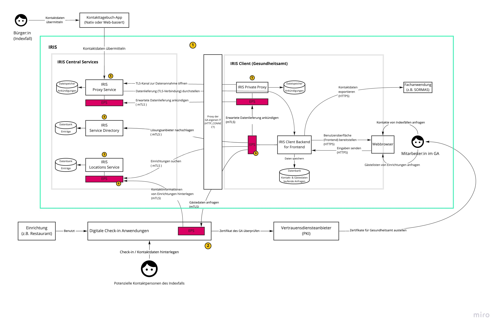

## IRIS connect Architektur

IRIS connect verfolgt nach den Prinzipien Security und Privacy by Design einen **dezentralen Ansatz** bei der Architektur. Der Austausch von personenbezogenen Daten (z.B. Gästelisten oder Kontakttagebüchern) findet dabei **Peer-to-Peer** und **Ende-zu-Ende-verschlüsselt** direkt zwischen den Lösungsanbietern bzw. Einzelpersonen und dem jeweiligen Gesundheitsamt statt. 

Auf den Einsatz zentraler Komponenten wurde bei der Verarbeitung vertraulicher Kontaktdaten verzichtet. Eine solche zentrale Architektur ist nicht nachhaltig, weil damit höhere Risiken für Sicherheit, Datenschutz und Robustheit des Gesamtsystems verbunden sind. Zentrale Datenhaltung ist grundsätzlich anfälliger für Datenpannen, die gleichzeitig einen ausgeweiteten Personenkreis betreffen. Der Ausfall einer zentralen Komponente verursacht einen höheren Verfügbarkeitsschaden für das Gesamtsystem.

IRIS connect besteht aus
* Einer Anwendungsschnittstelle in den Gesundheitsämtern (IRIS-Client), über die Mitarbeitende digital erfasste Daten von Einzelpersonen und Einrichtungen anfragen und abrufen können.
* Einem verteilten Netzwerk von Endpunkt-Servern (EPS), das den verschiedenen Akteuren bei IRIS connect eine dezentrale und Ende-zu-Ende-verschlüsselte Peer-to-Peer-Kommunikation ermöglicht.
* Einem zentralen Verzeichnisdienst und einem Proxy-Dienst. Lösungsanbieter "registrieren" sich bei dem Verzeichnisdienst und werden so für Gesundheitsämter im IRIS-System für dezentrale Peer-to-Peer-Kommunikation erreichbar. Der Proxy-Dienst hingegen vermittelt Datenlieferungen aus Webbrowsern und Apps, die nicht auf die dezentrale Peer-to-Peer-Kommunikation zurückgreifen können, weiter an in die Gesundheitsämter.

IRIS connect tritt als Vermittlung zwischen den Gesundheitsämtern und den verschiedenen digitalen Lösungen zur Datenerfassung auf.
Es erfolgt insbesondere keine zentrale Speicherung der übermittelten Daten.

Das folgende Schaubild visualisiert die Architektur und erklärt die zentralen Bestandteile.

*Schaubild der Akteure, Komponenten und typischen Use Cases von IRIS*

| Nummer | Bezeichnung | Erklärung |
| --- | --- | --- |
|1| IRIS connect | IRIS connect unterteilt sich in *IRIS Central Services* und den *IRIS-Client*. Erstere werden im Rechenzentrum der [AKDB](https://www.akdb.de/) gehostet und vom [IRIS connect Team](https://github.com/iris-connect) verwaltet. Der IRIS-Client wird mitsamt einer Dokumentation zum Download für die IT-Teams der Gesundheitsämter bereitgestellt. |
|2| Lösung zur digitalen Kontaktdatenerfassung| Ein weiterer wichtiger Teilnehmer in IRIS connect sind die Lösungen zur digitalen Kontaktdatenerfassung. Diese stammen zum größten Teil aus der Initiative [Wir für Digitaliserung](https://www.wirfuerdigitalisierung.de/). |
|3| Suchregister   (Locations Service) | Damit Einrichtungen, bei denen eine digitale Kontaktdatenerfassung im Einsatz ist vom Gesundheitsamt gefunden werden können, stellt IRIS connect ein zentrales Suchregister zur Verfügung. Die Daten im Suchregister werden von den Kontaktdatenerfassungs-Lösungen bereitgestellt. |
|4| Service Directory | Das vom IRIS connect Team verwaltete Service Directory enthält Einträge für alle teilnehmenden Akteure um IRIS connect. Zudem werden die Berechtigungen der Kommunikationsbeziehungen hier hinterlegt. |
|5| IRIS Proxy Service | Der IRIS Proxy Service ermöglicht es Einzelpersonen und Lösungsanbietern, Daten aktiv in ein Gesundheitsamt zu schicken. Dafür stellt der Proxy eine autorisierte Verbindung zwischen einer App bzw. einem Browser und einer Proxy-Komponente im Gesundheitsamt her. Der IRIS-Client im Gesundheitsamt muss dafür keine eingehenden Verbindungen zulassen. |
|6| Endpunktserver (EPS)| Herzstück der Punkt-zu-Punkt Kommunikation ist der IRIS [Endpunktserver (EPS)](https://github.com/iris-connect/eps/blob/master/README.md). Dabei handelt es sich um eine Komponente, die dezentral bei allen Akteure des IRIS connect Systems installiert wird. Die Kommunikation erfolgt gesichert über mTLS. |

Personenbezogene Daten werden zwischen den angebundenen Lösungen und den Gesundheitsämtern immer Ende-zu-Ende-verschlüsselt übertragen.
Dafür wird eine Transportverschlüsselung mit TLS/HTTPS eingesetzt bzw. mTLS bei Kommunikation über das EPS-Netzwerk.
Entschlüsselt wird erst im IRIS-Client Backend des jeweiligen Gesundheitsamts. Der IRIS Proxy Service leitet TLS-Verbindungen weiter an das jeweilige Gesundheitsamt, ohne sie zu terminieren (TLS-Passthrough).
Erst im IRIS-Client liegen die Daten dann unverschlüsselt vor.
Zusätzlich ist eine zusätzliche Inhaltsverschlüsselung gemäß Anforderung der Datenschutzkonferenz möglich.

Vor der Datenabfrage durch ein Gesundheitsamt liegen Daten ausschließlich bei der angebundenen Lösung und nicht im IRIS-System.
Es erfolgt insbesondere keine zentrale Speicherung der übermittelten Daten.

Die Kommunikation im EPS-Netzwerk findet immer authentifiziert und verschlüsselt mit mTLS statt. 
Kommunikation zwischen den IRIS Services und Clients (Browser oder Apps), die von Einzelpersonen oder Einrichtungsbetreibenden genutzt werden ist mit HTTPS gesichert.
Das IRIS-Client Frontend im GA (oder genauer gesagt der Browser, in dem die Webanwendung läuft) und das Backend des IRIS-Clients kommunizieren über ebenfalls HTTPS miteinander.
