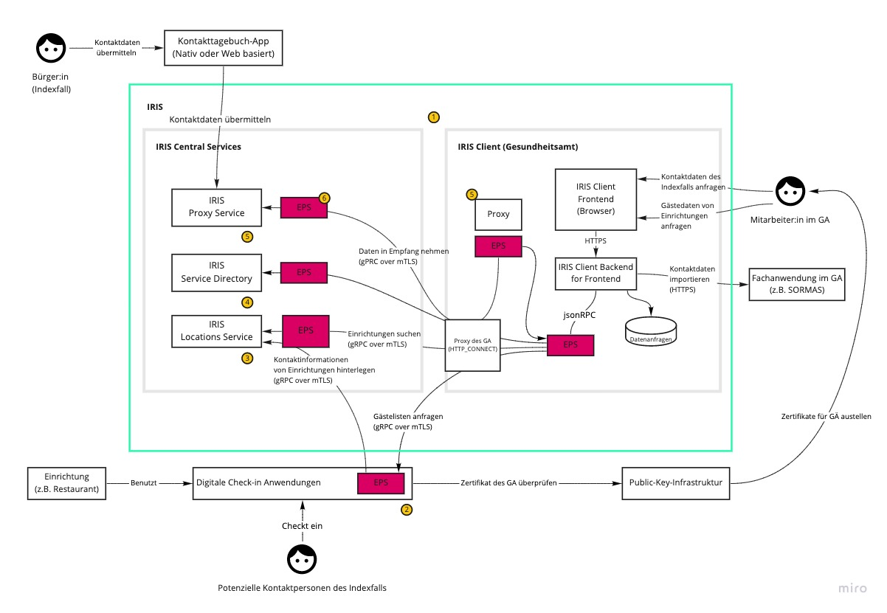

# IRIS Architektur

Das IRIS System baut auf einer dezentralen Architektur auf. Dabei findet der Austausch von persönlichen Daten (wie z.B. Gästelisten oder Kontakttagebüchern) direkt zwischen den App Anbietern und dem zuständigen Gesundheits am statt. 

Das folgende Schaubild visualisiert die Architektur und erklärt die zentralen Bestandteile. 

| Nummer | Erklärung |
|-|-|
|1| IRIS unterteilt sich in *IRIS Central Services* und den *IRIS Client*. Erstere werden zentral im Rechenzentrum der [AKDB](https://www.akdb.de/) gehostet und vom [IRIS Team](https://github.com/iris-connect) verwaltet. Der IRIS Client wird mitsamt einer Dokumentation zum Download für die IT-Teams der Gesundheitsämter bereitgestellt. |
|2| Ein weiterer wichtiger Teilnemer im IRIS System sind die Kontaktdaten Erfassungs Apps. Diese stammen zum größten Teil aus der Initiative [Wir für Digitaliserung](https://www.wirfuerdigitalisierung.de/). |
|3| Damit Einrichtungen dei dehnen eine digitale Kontaktdaten Erfassung im Einsatz ist vom Gesundheitsamt gefunden werden können, stellt IRIS ein zentrales Suchregister zur Verfügung. Die Daten im Suchregister werden von den Kontaktdaten Erfassungs Apps bereitgestellt. |
|4| Das vom IRIS Team verwaltete Service Directory enthält Einträge für alle teilnehmenden Akteure um IRIS System. Zudem werden die Berechtigungen der Kommunikationsbeziehungen hier hinterlegt. |
|5| Der IRIS Proxy Service ermöglicht es, Daten aktiv in ein Gesundheitsamt zu schicken. Dafür stellt der Proxy eine autorisierte Verbindung zwischen einer App und einer Proxy Komponente im GA her. Der IRIS Client im GA muss dafür keine eingehenden Verbindungen zulassen. |
|6| Herzstück der Punkt-zu-Punkt Kommunikation ist der IRIS Endpunktserver. Dabei handelt es sich um eine Komponente die dezentral bei allen Akteure des IRIS Systems installiert wird. Die Kommunikation erfolgt über gRPC mittels MTLS. Die dafür notwendigen Zertifikate werden vom IRIS Team ausgestellt. |

