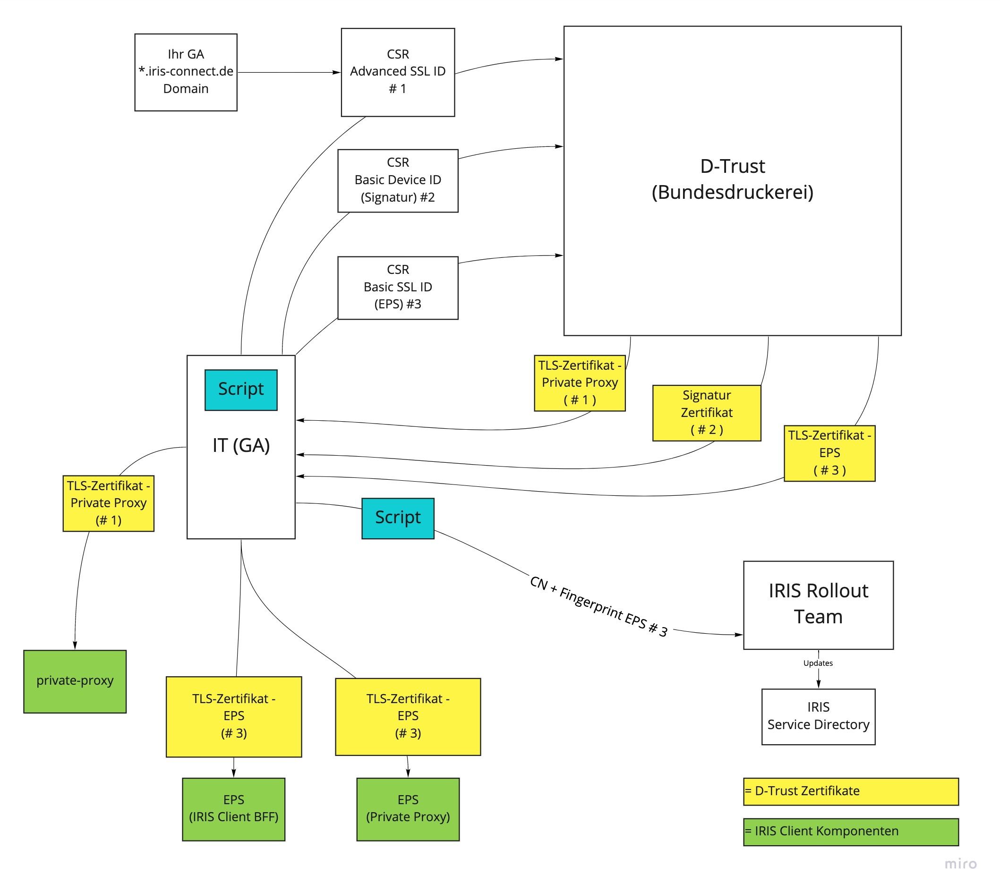
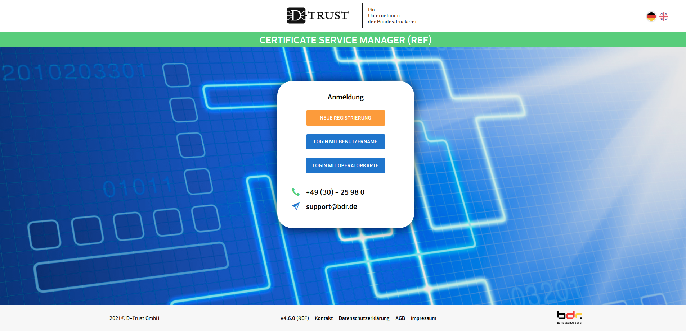
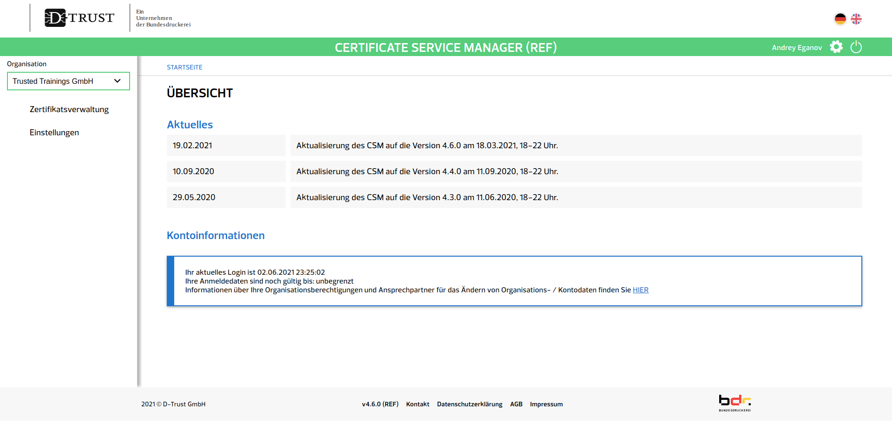
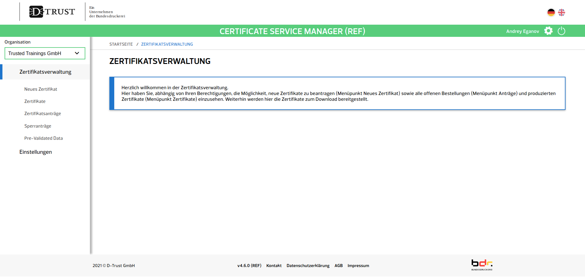
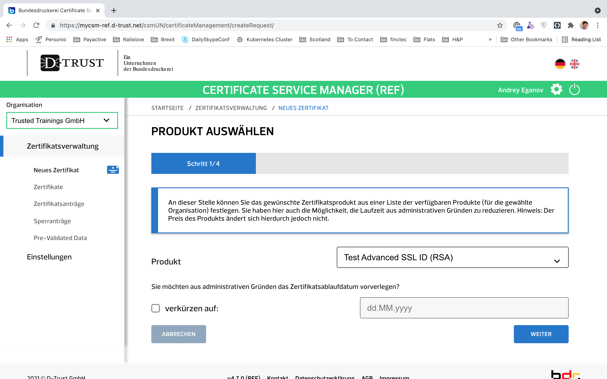
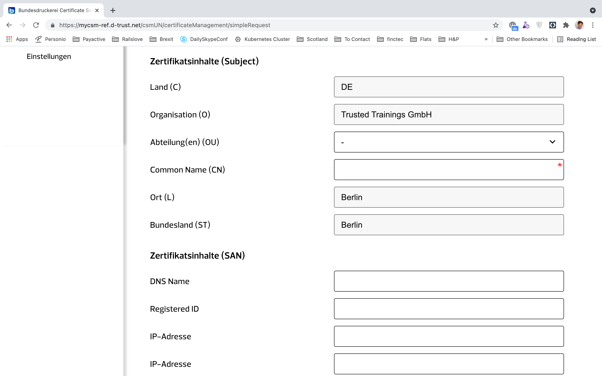
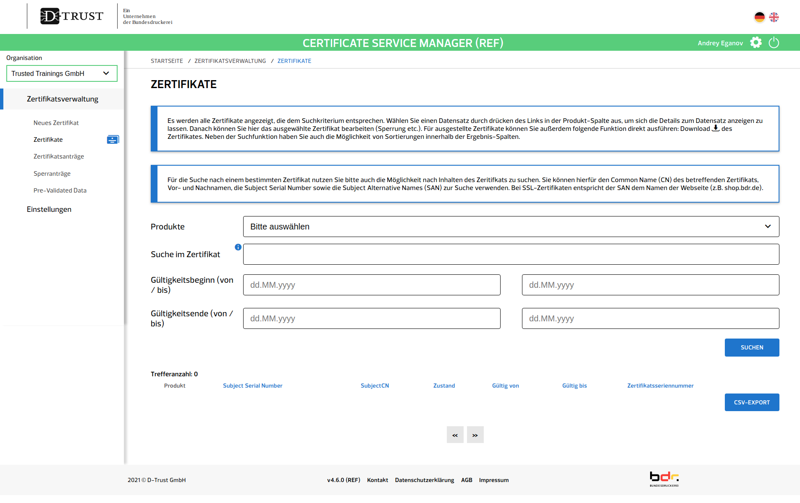

# Achtung

Aktueller Status: Aktuell befindet sich der prozess noch in der finalen Überarbeitung. Ein aktualisierter Prozess wird schnellstmöglich bereit gestellt. 

<br />
<br />
<br />

---

# Prozess für das Beantragen und Einrichten der Zertifikate <br /> – Technische Anleitung – 


## Vorwort
Für die Anbindung an IRIS benötigt ein Gesundheitsamt (GA, Plural GÄ) zwei Schlüsselpaare bzw. Zertifikate von der Bundesdruckerei. Zusätzlich werden noch weitere Zertifikate für das lokale Setup benötigt, die im Anschluss selbstständig mit einem Script erstellt werden können, also ohne Zutun der Bundesdruckerei.

Dieses Dokument erklärt die technischen Schritte, die Landesbehörden und Gesundheitsämter gemeinsam unternehmen müssen, um die Zertifikate zu beantragen bzw. zu erstellen und einzurichten.

Allgemeine Erläuterungen zum Prozess bzgl. der Domains und dem Antragsprozess bei der Bundesdruckerei werden zur besseren Übersicht in der [prozessualen Installationsanleitung](Certificate-Process_Prod_organizational.md) erläutert.
Diese wird an den entsprechenden Stellen verlinkt.

Dieses Dokument nimmt an, dass IRIS über das jeweilige Bundesland gebündelt für alle Gesundheitsämter bezogen wird.
Die Schritte für GÄ, die sich selbstständig, also unabhängig vom Land, an IRIS anschließen, unterscheiden sich stellenweise.

Beim Rollout von IRIS werden die individuellen Bedürfnisse und Wünsche der Bundesländer berücksichtigt.
Dadurch können sich von Land zu Land einige Unterschiede im Antragsprozess ergeben, auf die hier eingegangen wird.

Sollten die Gegebenheiten eines Bundeslandes nicht ausreichend berücksichtigt sein, bitten wir um kurzen Hinweis.


## Inhaltsverzeichnis

* [Welche Zertifikate müssen beantragt werden?](#welche-zertifikate-m-ssen-beantragt-werden-)
* [Erforderliche Schritte seitens der Landesbehörde](#erforderliche-schritte-seitens-der-landesbeh-rde)
   + [Domains für die Gesundheitsämter bereitstellen](#domains-f-r-die-gesundheits-mter-bereitstellen)
   + [DNS für die Domains konfigurieren](#dns-f-r-die-domains-konfigurieren)
* [Erforderliche Schritte seitens eines Gesundheitsamts](#erforderliche-schritte-seitens-eines-gesundheitsamts)
   + [Zertifikate Nr. 1 und Nr. 2 bei der Bundesdruckerei beantragen](#zertifikate-nr-1-und-nr-2-bei-der-bundesdruckerei-beantragen)
      - [Zertifikate online beantragen](#zertifikate-online-beantragen)
      - [Zertifikate herunterladen](#zertifikate-herunterladen)
      - [Zertifikate Nr. 1 und Nr. 2 einrichten](#zertifikate-nr-1-und-nr-2-einrichten)
* [Private Schlüssel sicher verwahren](#private-schlüssel-sicher-verwahren)


## Welche Zertifikate müssen beantragt werden?
Für die Anbindung an IRIS benötigt ein GA zwei Schlüsselpaare bzw. Zertifikate von der Bundesdruckerei (BDr) bzw. deren Vertrauensdiensteanbieter D-Trust:

| # Ref| Identifier | Beschreibung | D-Trust Produkt | Anwendungsfall |
| - | - | -| - | - |
| 1 | TLS-Zertifikat - Private Proxy | Ein TLS-Zertifikat für den IRIS Private Proxy des GA | Advanced SSL ID (RSA) | Identität des GA im Internet mit dem Ziel, Kontakttagüber und Gästelisten direkt ins GA zu übermitteln (TLS/HTTPS). |
| 2 | Signaturzertifikat | Ein Signaturzertifikat für Vertreter:in des GA  |Basic Device ID (ECC) | Signieren von Einträgen im Service Directory ( zukünftiges Feature ) |
| 3 (*Neu) | mTLS-Zertifikat - EPS | Ein mTLS Zertifikat welches sowohl für EPS ( IRIS Client BFF ) als auch für EPS ( IRIS Private Proxy ) benutzt werden kann. | Basic SSL ID (RSA) | Authentifizierung und Authentisierung der Kommunikation mit anderen zentralen und de-zentralen EPS Teilnehmern|

Das folgenden Schaubild gibt eine Top-Level-Sicht auf den Prozess des Beantragens und Einrichten der Zertifikate.




## Erforderliche Schritte seitens der Landesbehörde
### Domains für die Gesundheitsämter bereitstellen
Das Einrichten der Domains seitens der Landesbehörde erfolgen muss wird in der [prozessualen Installationsanleitung](Certificate-Process_Prod_organizational.md/#domains-f-r-die-gesundheits-mter-bereitstellen) beschrieben.
Es gibt keine feste Vorgabe für die Benennung der Domains. 
Wir empfehlen aber den offiziellen RKI-Namen des Gesundheitsamts zu verwenden (für Bonn bswp. "Stadt Bonn").

```
# Beispiel Stadt Bonn
Offizieller RKI Name:   Stadt Bonn
sanitized_name:         stadt-bonn
IRIS Identifier:        ga-stadt-bonn
Vorschlag Domain:       ga-stadt-bonn.iris-connect.nrw.de
```

**Hinweis**: Die aktuellen Domains können vom Vorschlag des IRIS Teams abweichen. 

### DNS für die Domains konfigurieren

Zunächst muss ein CNAME-Record gesetzt werden, damit alle GA-Subdomains auf den IRIS Proxy Service auflösen: 

```
# Beispiel NRW
*.iris-connect.nrw.de    CNAME prod.iris-gateway.de
```

Als nächstes muss ein [CAA-Record](https://de.wikipedia.org/wiki/DNS_Certification_Authority_Authorization) (Certificate Authority Authorization) vorgenommen werden. Damit wird eingeschränkt, welche CAs Zertifikate für die GA-Domains ausstellen dürfen. Dieser Schritt ist essentziell, um die Sicherheit der späteren Kommunikation sicherzustellen.

```
# Beispiel NRW
iris-connect.nrw.de    CAA 0 issue "d-trust.net"
```


## Erforderliche Schritte seitens eines Gesundheitsamts
### Zertifikat Nr 1 ( TLS-Zertifikat - Private Proxy ) online beantragen
Die Bundesdruckerei lädt die jeweils zertifikatsverantwortliche Person per signierter E-Mail zum sog. Certificate Service Manager (CSM) ein, einem Online-Verwaltungsportal für Zertifikate.
Darin können die Zertifikate anschließend mit wenigen Klicks beantragt werden.

Im Folgenden betrachten wir die Antragsstrecke für Zertifikat Nr. 1.

Antragsstrecke:

1. Navigieren Sie in einem Webbrowser zum CSM. Dieses befindet sich unter [https://mycsm.d-trust.net/csm/](https://mycsm.d-trust.net/csm/).
   


2. Klicken Sie auf "Login mit Username".
   Tragen Sie dann dem Username und das Passwort ein, die Sie nach Erhalt der Einladung für Ihren Antragsteller-Account im CSM gewählt haben.
   Klicken Sie dann auf "Login".
   Es öffnet sich die "Übersicht".
   


4. In der linken Seitenleiste auf "Zertifikatsverwaltung" klicken. Es öffnet sich die "Zertifikatsverwaltung".
   


5. In der linken Seitenleiste auf "Neues Zertifikat" klicken. Es öffnet sich die Ansicht "Produkt auswählen – Schritt 1/4".
   
   


6. Selektieren Sie als Produkt "Advanced SSL ID (RSA)".
   Klicken Sie anschließend auf weiter. Es öffnet sich die Ansicht "Neues Zertifikat – Schritt 2/4". Klicken Sie auf den Link für die  vereinfachte Beantragung mit Angabe der Zertifikatsdaten. 

   

7. Es öffnet sich eine Webform mit deren Hilfe Sie Ihre Daten für den CSR angeben können. Tragen Sie bitte folgende Daten ein. Felder die in der Tabelle nicht erwähnt sind, lassen Sie bitte leer bzw. mit dem vorausgefüllten Wert. 

   | Feld | Wert | Beispiel |
   | - | - | - |
   | Common Name (CN) | Die von der Landesbehörde bereitgestellte Domain für Ihr GA | Beispiel Bonn: ga-bonn.iris-connect.nrw.de |
   | Organisation (O) | Die zuständige Landesbehörde | IT.NRW für Nordrhein Westfalen |
   | Unter SAN -> Erster DNS Eintrag | Die von der Landesbehörde bereitgestellte Domain für Ihr GA | Beispiel Bonn: ga-bonn.iris-connect.nrw.de |
   | Unter SAN -> Zweiter DNS Eintrag | Ergänzener Wildcard DNS Eintrag | Beispiel Bonn: *.ga-bonn.iris-connect.nrw.de |   

   

   Im nächsten Abschnitt müssen sie einen öffentlichen Schlüssel hochladen. Erstellen Sie sich dafür zunächste ein Private-Public Schlüsselpaar mit [diesem Skript](../scripts/production/generate-rsa-key-pair.sh). 

   ```
   $ sh generate-rsa-key-pair.sh TLS-Zertifikat
   $ ls -l
   -rw-------  1 TLS-Zertifikat.key
   -rw-r--r--  1 TLS-Zertifikat.pub
   ```

   Laden Sie das TLS-Zertifikat.pub in das entsprechende Feld hoch.

   Zum Abschluß muss ein Sperrpasswort gesetzt werden, dass Sie – wenn nichts schief geht – niemals brauchen werden.

8. Klicken Sie auf "weiter. Sie landen auf einer Übersichtsseite, die Ihnen eine Zusammenfassung der Informationen anzeigt. Akzeptieren Sie das Subscriber Agreement und klicken Sie auf fertig.
   

### Zertifikat Nr 2 ( Signaturzertifikat ) online beantragen

Führen Sie bitte Schritte 1-5 aus dem vorhergehenden Abschnitt aus. 


6. Wählen Sie als Produkt "Basic Device ID (ECC)" für Zertifikat Nr. 2 aus.   
   Klicken Sie anschließend auf weiter. Es öffnet sich die Ansicht "Neues Zertifikat – Schritt 2/4". Klicken Sie auf den Link für die  vereinfachte Beantragung mit Angabe der Zertifikatsdaten. 

   

7. Es öffnet sich eine Webform mit deren Hilfe Sie Ihre Daten für den CSR angeben können. Tragen Sie bitte folgende Daten ein. Felder die in der Tabelle nicht erwähnt sind, lassen Sie bitte leer bzw. mit dem vorausgefüllten Wert. 

   | Feld | Wert | Beispiel |
   | - | - | - |
   | Organisation (O) | Die zuständige Landesbehörde | IT.NRW für Nordrhein Westfalen |
   | Common Name (CN) | iris-connect-signature-cert-${Ihr RKI Identifier} | Beispiel Bonn: iris-connect-signature-cert-ga-stadt-bonn |
   | Abteilung (OU) | IRIS | IRIS |


   

   Im nächsten Abschnitt müssen sie einen öffentlichen Schlüssel hochladen. Erstellen Sie sich dafür zunächste ein Private-Public Schlüsselpaar mit [diesem Skript](../scripts/production/generate-signature-key-pair.sh).  

   ```
   $ sh generate-signature-key-pair.sh Signatur-Zertifikat
   $ ls -l
   -rw-------  1 Signatur-Zertifikat-priv-key.pem
   -rw-r--r--  1 Signatur-Zertifikat-pub-key.pem   
   ```

   Laden Sie das Signatur-Zertifikat-pub-key.pem  in das entsprechende Feld hoch.

   Zum Abschluß muss ein Sperrpasswort gesetzt werden, dass Sie – wenn nichts schief geht – niemals brauchen werden.

### Zertifikat Nr. 3 ( mTLS-Zertifikat - EPS ) online beantragen

Führen Sie bitte Schritte 1-5 aus dem vorhergehenden Abschnitt aus. 


6. Wählen Sie als Produkt "Basic SSL ID (RSA)" für Zertifikat Nr. 3 aus.   
   Klicken Sie anschließend auf weiter. Es öffnet sich die Ansicht "Neues Zertifikat – Schritt 2/4". Klicken Sie auf den Link für die  vereinfachte Beantragung mit Angabe der Zertifikatsdaten. 

   

7. Es öffnet sich eine Webform mit deren Hilfe Sie Ihre Daten für den CSR angeben können. Tragen Sie bitte folgende Daten ein. Felder die in der Tabelle nicht erwähnt sind, lassen Sie bitte leer bzw. mit dem vorausgefüllten Wert. 

   | Feld | Wert | Beispiel |
   | - | - | - |
   | Common Name (CN) | eps.${Domain aus Zertifikat Nr. 1} | Beispiel Bonn: eps.ga-bonn.iris-connect.nrw.de |
   | Organisation (O) | Die zuständige Landesbehörde | IT.NRW für Nordrhein Westfalen |
   | Unter SAN -> Erster DNS Eintrag | Den selben Wert die bei CN | Beispiel Bonn: eps.ga-bonn.iris-connect.nrw.de |
   | Unter SAN -> Zweiter DNS Eintrag | eps-proxy.${Domain aus Zertifikat Nr. 1} | Beispiel Bonn: eps-proxy.ga-bonn.iris-connect.nrw.de |   


   

   Im nächsten Abschnitt müssen sie einen öffentlichen Schlüssel hochladen. Erstellen Sie sich dafür zunächste ein Private-Public Schlüsselpaar mit [diesem Skript](../scripts/production/generate-rsa-key-pair.sh). 

   ```
   $ sh generate-rsa-key-pair.sh mTLS-Zertifikat-EPS
   $ ls -l
   -rw-------  1 mTLS-Zertifikat-EPS.key
   -rw-r--r--  1 mTLS-Zertifikat-EPS.pub
   ```

   Laden Sie das mTLS-Zertifikat-EPS.pub in das entsprechende Feld hoch.

   Zum Abschluß muss ein Sperrpasswort gesetzt werden, dass Sie – wenn nichts schief geht – niemals brauchen werden.


8. Klicken Sie auf "weiter. Sie landen auf einer Übersichtsseite, die Ihnen eine Zusammenfassung der Informationen anzeigt. Akzeptieren Sie das Subscriber Agreement und klicken Sie auf fertig.

### Zertifikate herunterladen
Sobald die Zertifikate fertig sind erhalten Sie eine Benachrichtigung an die im CSM hinterlegte E-Mail-Adresse.
Sie können die Zertifikate dann einfach im CSM herunterladen.

1. Navigieren Sie wieder im Webbrowser zum CSM unter [https://mycsm.d-trust.net/csm/](https://mycsm.d-trust.net/csm/) und loggen Sie sich dort ein.
   


2. In der linken Seitenleiste auf "Zertifikatsverwaltung" klicken. Es öffnet sich die "Zertifikatsverwaltung".
   


3. In der linken Seitenleiste auf "Zertifikate" klicken. Es öffnet sich die Ansicht "Zertifikate".
   Im unteren Bereich sollten Sie die zwei fertigen Zertifikate Nr. 1 und Nr. 2 sehen können.
   Falls hier nur ein Zertifikat angezeigt wird, machen Sie sich keine Sorgen;
   Eine kleine Verzögerung (im Bereich von Minuten bis Stunden) ergibt sich aufgrund des manuellen Freigabeprozesses.
   Klicken Sie auf "Download", um die zwei Zertifikate herunterzuladen.
   


### Zertifikate einrichten

Die Zertifikate werden analog zur Staging Umgebung eingerichtet. 

#### Zertifikat Nr. 1 einrichten

Analog zu [Einrichtung: TLS-Zertifikat ( Private Proxy )](Installation-Docker-Compose.md)

#### Zertifikat Nr. 3 einrichten

Analog zu [Einrichtung GA Client Zertifikat für Staging](Installation-Docker-Compose.md)

#### Zertifikat Nr. 4 einrichten

Analog zu [Einrichtung Proxy Client Zertifikat für Staging](Installation-Docker-Compose.md)

## Private Schlüssel sicher verwahren
Private Schlüssel sollten aufgrund der hohen Schutzniveaus der Daten, die sie schützen besonders gesichert und redundant verwahrt werden.

Um einem Schlüsselverlust durch Ausfall oder Beschädigung eines einzelnen IT-Systems vorzubeugen sollten alle privaten Schlüssel redundant auf mindestens zwei voneinander unabhängigen Speichermedien verwahrt werden.

Zur sicheren Verwahrung kann ein Schlüssel in einem Trusted Platform Module (TPM) oder ein Hardware Security Module (HSM) abgelegt werden. 
Falls die genutzte Infrastruktur über kein TPM oder HSM verfügt, können auch für diesen Zweck ausgelegte Standard-Produkte von Herstellern wie Herstellern wie [Nitrokey](https://www.nitrokey.com/de) oder [Yubico](https://www.yubico.com/?lang=de) erworben werden, die es in Form von USB-Sticks gibt. 

Als etwas abgeschwächte Alternative kann ein Schlüssel auf einem herkömmlichen USB-Speichergerät (Stick, Festplatte) in einer verschlüsselten Partition abgelegt werden. 
Eine verschlüsselte Partition kann auf allen USB-Speichergeräten in wenigen Minuten erstellt werden. Unter Linux kann dafür beispielsweise LUKS mit [dieser Anleitung](https://www.kuketz-blog.de/dm-crypt-luks-daten-unter-linux-sicher-verschluesseln/) benutzt werden.
