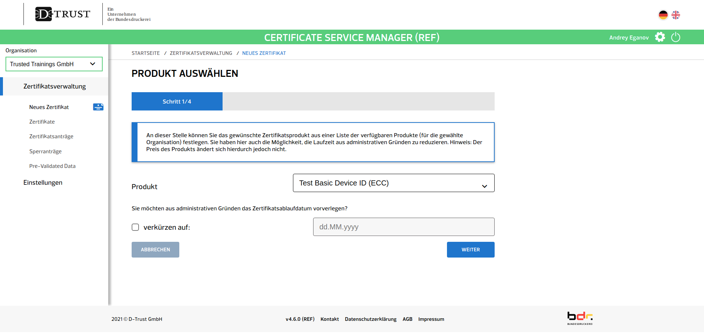

# Prozess für das Beantragen und Einrichten der Zertifikate <br /> – Technische Anleitung – 


## Vorwort

## Welche Zertifikate müssen beantragt werden?
Für die Anbindung an IRIS benötigt ein GA zwei Schlüsselpaare bzw. Zertifikate von der Bundesdruckerei (BDr) bzw. deren Vertrauensdiensteanbieter D-Trust:

1. Ein TLS-Zertifikat für das IRIS-Client-Backend des GA  
   Anwendungsfall: Identität des GA im Internet (TLS/HTTPS).


2. Ein Signaturzertifikat für Vertreter:in des GA  
   Anwendungsfall: Identität des GA im EPS-Netzwerk.

Liegen diese vor, müssen drei weitere Zertifikate vom GA oder dessen IT-Dienstleister, je nachdem, wer den IRIS-Client betreibt, erstellt werden. 
Dafür ist kein Zutun der Bundesdruckerei nötig.

3. Ein mTLS-Zertifikat für den EPS-Server des IRIS-Client-BFF des GA
   Anwendungsfall: Absicherung der Kommunikation zwischen EPS-Servern.
  

4. Ein mTLS-Zertifikat für den EPS-Server des IRIS Private Proxy des GA
   Anwendungsfall: Absicherung der Kommunikation zwischen EPS-Servern.


5. Ein Ende-zu-Ende-Zertifikat für das IRIS-Client-Backend des GA  
   Anwendungsfall: Umsetzung der Datenschutzkonferenz-Anforderung an Betreiber von digitaler Kontaktdatenerfassung,
   wonach zusätzlich zur Transportverschlüsselung (TLS) eine zweite Verschlüsselungsschicht auf Anwendungsebene (Inhaltsverschlüsselung) umzusetzen ist.


## Erforderliche Schritte seitens der Landesbehörde
### Domains für die Gesundheitsämter bereitstellen
Das Einrichten der Domains seitens der Landesbehörde erfolgen muss wird in der [prozessualen Installationsanleitung](Certificate-Process_Prod_organizational.md/#domains-f-r-die-gesundheits-mter-bereitstellen) beschrieben.
Es gibt keine feste Vorgabe für die Benennung der Domains. 
Wir empfehlen aber den offiziellen RKI-Namen des Gesundheitsamts zu verwenden (für Bonn bswp. "Stadt Bonn").

<mark>**TODO: RKI-Schema und Normalisierung erklären**</mark>

#### DNS für die Domains konfigurieren

Zunächst muss ein A-Record gesetzt werden, damit alle GA-Subdomains uf die IP des IRIS Public Proxy auflösen: 

```
*.iris-connect.nrw.de    A [IP des IRIS Public Proxy]
```

Für die IRIS-Stammdomain des Landes muss ein [CAA-Record](https://de.wikipedia.org/wiki/DNS_Certification_Authority_Authorization) (Certificate Authority Authorization) vorgenommen werden.
Dieser legt fest, welche CAs für die IRIS-Stammdomain Zertifikate ausstellen dürfen: 

```
iris.nrw.de    CAA 0 issue "d-trust.net"
```


## Erforderliche Schritte seitens eines Gesundheitsamts
### Zertifikate Nr. 1 und Nr. 2 bei der Bundesdruckerei beantragen
#### Zertifikate online beantragen
Die Bundesdruckerei lädt die jeweils zertifikatsverantwortliche Person per signierter E-Mail zum sog. Certificate Service Manager (CSM) ein, einem Online-Verwaltungsportal für Zertifikate.
Darin können die Zertifikate anschließend mit wenigen Klicks beantragt werden.

Im Folgenden betrachten wir die Antragsstrecke für Zertifikat Nr. 1.
Zertifikat Nr. 2 wird anschließend analog beantragt.

Antragsstrecke:

1. Navigieren Sie in einem Webbrowser zum CSM. Dieses befindet sich unter [https://mycsm.d-trust.net/csm/](https://mycsm.d-trust.net/csm/).
   


2. Klicken Sie auf "Login mit Username".
   Tragen Sie dann dem Username und das Passwort ein, die Sie nach Erhalt der Einladung für Ihren Antragsteller-Account im CSM gewählt haben.
   Klicken Sie dann auf "Login".
   Es öffnet sich die "Übersicht".
   


4. In der linken Seitenleiste auf "Zertifikatsverwaltung" klicken. Es öffnet sich die "Zertifikatsverwaltung".
   


5. In der linken Seitenleiste auf "Neues Zertifikat" klicken. Es öffnet sich die Ansicht "Produkt auswählen – Schritt 1/4".
   
   Die Produktauswahl ist auf zwei Wahlmöglichkeiten beschränkt: "Advanced SSL ID (RSA)" für Zertifikat Nr. 1 und "Basic Device ID (EC)" für Zertifikat Nr. 2.


6. Wählen Sie als Produkt "Advanced SSL ID (RSA)" für Zertifikat Nr. 1 aus.
   Klicken Sie anschließend auf weiter. Es öffnet sich die Ansicht "Neues Zertifikat – Schritt 2/4".
   Hier muss ein Certificate Signing Request (CSR) zu Zertifikat Nr. 1 hochgeladen werden.
   Diesen können Sie einfach mit einem Script erstellen, das mit dem IRIS-Client zur Verfügung gestellt wird.  
   <mark>**TODO: Ein Script erstellen, das als Input das Signaturzertifikat und einige Parameter nimmt und CSRs zu Zertifikat Nr. 1 und 2 ausspuckt.**</mark>
   ```
   TODO: Script-Aufrufe 
   ```
   
   Zusätzlich muss ein Sperrpasswort gesetzt werden, dass Sie – wenn nichts schief geht – niemals brauchen werden.


7. Klicken Sie auf "weiter".  
   <mark>**TODO: Schritte 3 und 4 anhand eines echten CSR beschreiben.**</mark>


#### Zertifikate herunterladen
Sobald die Zertifikate fertig sind erhalten Sie eine Benachrichtigung an die im CSM hinterlegte E-Mail-Adresse.
Sie können die Zertifikate dann einfach im CSM herunterladen.

1. Navigieren Sie wieder im Webbrowser zum CSM unter [https://mycsm.d-trust.net/csm/](https://mycsm.d-trust.net/csm/) und loggen Sie sich dort ein.
   


2. In der linken Seitenleiste auf "Zertifikatsverwaltung" klicken. Es öffnet sich die "Zertifikatsverwaltung".
   


3. In der linken Seitenleiste auf "Zertifikate" klicken. Es öffnet sich die Ansicht "Zertifikate".
   Im unteren Bereich sollten Sie die zwei fertigen Zertifikate Nr. 1 und Nr. 2 sehen können.
   Falls hier nur ein Zertifikat angezeigt wird, machen Sie sich keine Sorgen;
   Eine kleine Verzögerung (im Bereich von Minuten bis Stunden) ergibt sich aufgrund des manuellen Freigabeprozesses.
   Klicken Sie auf "Download", um die zwei Zertifikate herunterzuladen.
   


#### Zertifikate Nr. 1 und Nr. 2 einrichten
<mark>**TODO**</mark>

## Zertifikate Nr. 3 bis 5
Sobald Zertifikat Nr. 2 vorliegt können die Zertifikate Nr. 3 bis 5 vom GA, bzw. dessen IT-Dienstleister,
je nachdem, wer den IRIS-Client betreibt, selbstständig erstellt werden, also ohne Zutun der Bundesdruckerei.

### Zertifikate erstellen
Das Erstellen der Zertifikate Nr. 3 bis 5 übernimmt ein Script, das mit dem IRIS-Client zur Verfügung gestellt wird.

<mark>**TODO: Ein Script erstellen, das als Input das Signaturzertifikat und einige Parameter nimmt und Zertifikate Nr. 3 und 4 ausspuckt.**</mark>

```
TODO: Script-Aufrufe 
```

### Zertifikate einrichten
<mark>**TODO: Prozesse ggf. definieren und dokumentieren im IRIS-Client-Repo und copy-paste hierher.**</mark>

#### Zertifikat Nr. 3 einrichten

#### Zertifikat Nr. 4 einrichten

#### Zertifikat Nr. 5 einrichten

## Zertifikate sicher verwahren
<mark>**TODO: Beschreiben, wie mit den einzelnen Zertifikaten im Anschluss umgegangen werden soll. Z.B. Zertifikat Nr. 2 air-gaped verwahren.**</mark>
