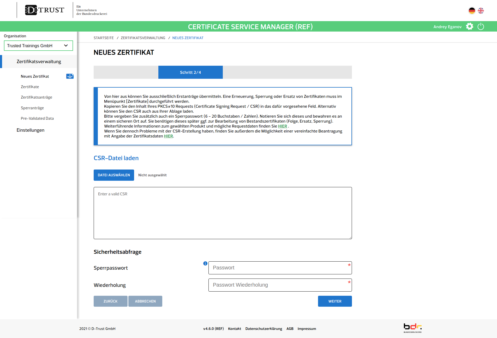

# Anleitung für das Beantragen und Einrichtung der Zertifikate (IRIS Produktivsystem)

## Vorwort

Für die Anbindung an IRIS benötigt ein Gesundheitsamt (GA, Plural GÄ) vier Schlüsselpaare bzw. Zertifikate. 
Dieses Dokument erklärt, wie Landesbehörden und Gesundheitsämter die Zertifikate gemeinsam beantragen und einrichten.

Die Anleitung nimmt an, dass IRIS über das jeweilige Bundesland gebündelt für alle Gesundheitsämter bezogen wird.
Die Schritte für GÄ, die sich selbstständig, also unabhängig vom Land, an IRIS anschließen, unterscheiden sich stellenweise.

Beim Rollout von IRIS werden die individuellen Bedürfnisse und Wünsche der Bundesländer berücksichtigt. 
Dadurch können sich von Land zu Land einige Unterschiede im Antragsprozess ergeben, auf die hier eingegangen wird.

Sollten die Gegebenheiten eines Bundeslandes nicht ausreichend berücksichtigt sein, bitten wir um kurzen Hinweis.

**TODO: Kontaktmöglichkeit oder Link auf contribution guideline**

## Inhaltsverzeichnis
* [Überblick]()
* [Welche Zertifikate gibt es?]()
* [Erforderliche Schritte seitens der Landesbehörde]()
    * [Antragsprozess bei der Bundesdruckerei anstoßen]()
    * [Ansprechpersonen in den Gesundheitsämtern erfassen]()
    * [Domains für die Gesundheitsämter bereitstellen]()
    * [Identitätsprüfung durchlaufen]()
* [Erforderliche Schritte seitens des GA]()
    * [Zertifikate Nr. 1 und Nr. 2 bei der Bundesdruckerei beantragen]()
        * [Ansprechperson benennen]()
        * [Zertifikate online beantragen]()
        * [Zertifikate herunterladen]()
        * [Zertifikate einrichten]()
    * [Zertifikate Nr. 3 und Nr. 4 erstellen]()
        * [Zertifikate erstellen]()
        * [Zertifikate einrichten]()
    * [Zertifikate sicher verwahren]()


## Überblick
Für die Anbindung an IRIS auf Landesebene ist die Mitwirkung einer Landesbehörde nötig.
Diese tritt im Rahmen der Identitätsprüfung gegenüber der Bundesdruckerei stellvertretend für alle GÄ des Landes auf.
Die GÄ brauchen den Prüfungsprozess also nicht separat zu durchlaufen.

Der ganze Prozess kurz gefasst:

1. Behörde stellt den GÄ ggf. eine (Sub-)Domain bereit, die im Kontext von IRIS genutzt werden kann.
2. Vertreter:in der Behörde nennt der Bundesdruckerei (BDr) auf sicherem Weg eine Vertreter:in je GA.
3. BDr prüft Identität von Vertreter:in der Behörde und deren Vertretungsberechtigung.
4. BDr übermittelt Zugangsdaten zum Antragsportal auf sicherem Wege an die Vertreter:innen der GÄ.
5. GÄ erstellen kryptografische Schlüssel und stellen für diese Zertifikatsanfragen online im Antragsportal ein.
6. Nach Prüfung und Domain-Validierung der (Sub-)Domain des GA stellt die BDr die Zertifikate zum Download im Antragsportal bereit.
8. GÄ erstellen weitere Zertifikate ohne Zutun der BDr gemäß Anleitung.
7. GÄ konfigurieren die Zertifikate und die Domain im IRIS-Client gemäß Anleitung.


## Welche Zertifikate gibt es?

Für die Anbindung an IRIS benötigt ein GA vier Schlüsselpaare bzw. Zertifikate. Davon müssen zwei bei der
Bundesdruckerei (BDr) bzw. deren Vertrauensdiensteanbieter D-Trust beantragt werden.

1. Ein TLS-Zertifikat für das IRIS-Client-Backend des GA  
Anwendungsfall: Identität des GA im Internet (TLS/HTTPS).


2. Ein Signaturzertifikat für Vertreter:in des GA  
Anwendungsfall: Identität des GA im EPS-Netzwerk.

Die verbleibenden zwei Zertifikate können im Anschluss vom GA oder dessen IT-Dienstleister, je nachdem, wer den
IRIS-Client betreibt, selbstständig erstellt werden, also ohne Zutun der Bundesdruckerei.

3. Ein mTLS-Zertifikat für den EPS-Server des GA  
Anwendungsfall: Absicherung der Kommunikation zwischen EPS-Servern.


4. Ein Ende-zu-Ende-Zertifikat für das IRIS-Client-Backend des GA  
Anwendungsfall: Umsetzung der Datenschutzkonferenz-Anforderung an Betreiber von digitaler Kontaktdatenerfassung,
wonach zusätzlich zur Transportverschlüsselung (TLS) eine zweite Verschlüsselungsschicht auf Anwendungsebene (Inhaltsverschlüsselung) umzusetzen ist.


## Erforderliche Schritte seitens der Landesbehörde

> Hinweis: Folgende Schritte beziehen sich auf Bundesländer, in denen eine Landesbehörde im Rahmen der Einführung von IRIS jedem GA eine Domain bereitstellt.

### Antragsprozesses bei der Bundesdruckerei anstoßem
Der Antragsprozess wird dadurch angestoßen, dass ein vertretungsberechtigtes Mitglied der Landesbehörde auf sicherem Weg Kontakt zur Bundesdruckerei aufnimmt.
Die Identität dieser Person, sowie ihre Vertretungsberechtigung werden von der BDr zu gegebenem Zeitpunkt geprüft.

Für das Beantragen und Ausgeben der Zertifikate gibt das Bundesamt für Sicherheit in der Informationstechnik (BSI) ein sogenanntes "hohes Schutzniveau" vor (Technische Richtlinie [TR-03107-1](https://www.bsi.bund.de/SharedDocs/Downloads/DE/BSI/Publikationen/TechnischeRichtlinien/TR03107/TR-03107-1.html)).
Normale E-Mails als Kommunikationsmittel gelten in diesem Zusammenhang als unsicher und dürfen nur behilfsweise genutzt werden. 
Spätestens die Übergabe der fertig befüllten Liste der GÄ (siehe unten) muss hinreichend abgesichert erfolgen.

Vorgesehen ist eine mit S/MIME digital signierte und verschlüsselte E-Mail. 
Die BDr hat hierfür ein sicheres E-Mail-Postfach eingerichtet, an das verschlüsselt gemailt werden kann. 

<mark>**TODO: Einzelheiten des S/MIME-Postfachs (z.B. Adresse, S/MIME-Key) mit BDr abstimmen**</mark>

<mark>**TODO: Beschreibung wie der S/MIME-Key der BDr in Outlook konfiguriert wird**</mark>

### Ansprechpersonen in den Gesundheitsämtern erfassen
Die Landesbehörde muss der Bundesdruckerei eine Liste der GÄ übermitteln, die Zertifikate erhalten sollen. 

Dabei muss je GA muss eine Kontaktperson vor Ort und deren Erreichbarkeit angegeben werden. 
Dazu gehören Anrede, Titel, Vorname, Nachname, Funktion, Telefonnummer, E-Mail-Adresse.

Zusätzlich muss je GA auch ein Domain (Internetadresse) angegeben werden, unter der Bürger:innen das GA im Kontext von
IRIS erreichen können (z.B. mit einem Webbrowser). Eine beispielhafte Domain wäre ```beispiel.de```.

Das sieht für das GA Bonn beispielsweise so aus:
<table>
<th rowspan="2">Kommune</th>
<th colspan="7">Ansprechperson im Gesundheitsamt</th>
<th rowspan="2">Domain des Gesundheitsamts für IRIS</th>
<tr>
<td>Anrede</td>
<td>Titel</td>
<td>Vorname</td>
<td>Nachname</td>
<td>Funktion</td>
<td>Telefonnummer</td>
<td>E-Mail-Adresse</td>
</tr>
<tr>
<td>Bonn</td>
<td>Frau</td>
<td>Dr.</td>
<td>Alisha</td>
<td>Riedel</td>
<td>IT-Administratorin für das Gesundheitsamt Bonn</td>
<td>+49 (0) 228 / 234 567 - 8</td>
<td>alisha.riedel@gesundheitsamt-bonn.de</td>
<td>bonn.iris-conncet.nrw.de</td>
</tr>
<tr>
<td>Aachen</td>
<td></td>
<td></td>
<td></td>
<td></td>
<td></td>
<td></td>
<td></td>
<td></td>
</tr>
</table>

Ist die Liste fertig gefüllt, übermitteln Sie sie auf sicherem Weg an die BDr. 
Vorgesehen ist hier wieder eine mit S/MIME digital signierte und verschlüsselte E-Mail.

Wenn gewünscht können diese Informationen auch in einem Wiki-System (Confluence) der BDr zusammengetragen werden.
Die BDr wird auf Anfrage die genauen Schritte zur Freischaltung eines Zugangs erläutern.


### Domains für die Gesundheitsämter bereitstellen
Bei den Domains gibt es zwei frei wählbare Gestaltungsmöglichkeiten:

**Möglichkeit 1: Die Behörde verwendet eine bereits bestehende Domain**

Im folgenden Beispiel gehen wir davon aus, dass die Behörde bereits eine Domain besitzt, hier ```www.nrw.de```.

In diesem Fall muss zunächst eine Subdomain angelegt werden, die im Kontext von IRIS angesprochen werden kann. 
Es gibt keine feste Vorgabe für die Benennung dieser Subdomain, wir empfehlen aber ```iris-connct```. Damit ergibt
sich ```iris-connect.nrw.de```.

Als Nächstes muss für jedes GA eine weitere Subdomain unterhalb der gerade erzeugten angelegt werden. 
So ergibt sich für dsa GA Bonn ```bonn.iris-connect.nrw.de``` oder ```gesundheitsamt-bonn.iris-connect.nrw.de```. 
Auch hier gibt es keine feste Vorgabe für die Benennung.

**Möglichkeit 2: Die Behörde verwendet eine neue Domain, die sie vorab erwirbt**

Im folgenden Beispiel gehen wir davon aus, dass eine neue Domain verwendet werden soll, die es noch nicht gibt.
Diese muss dann erst bei einem Domain-Anbieter käuflich erworben werden. Nennen wir sie ```iris-thueringen.de```. 
Es gibt keine feste Vorgabe für die Benennung der Domain.

Für diese Subdomain muss ein sogenannter DNS [CAA-Eintrag](https://de.wikipedia.org/wiki/DNS_Certification_Authority_Authorization) (Certificate Authority Authorization) vorgenommen werden. 
Mit diesem Eintrag wird festgelegt, wer für die Domain Zertifikate ausstellen darf. 
Er kann vom Administrator bzw. der Administratorin direkt im Verwaltungsportal des Domain-Anbieters vorgenommen werden und sollte so aussehen:
```iris.nrw.de    CAA 0 issue "d-trust.net""```

Als Nächstes muss für jedes GA eine Subdomain angelegt werden. Für das GA Erfurt ergibt sich bspw.```erfurt.iris-thueringen.de``` oder ```gesundheitsamt-erfurt.iris-thueringen.de```. 
Auch hier gibt es wieder keine feste Vorgabe für die Benennung.

### Identitätsprüfung durchlaufen
Sobald die Liste der Gesundheitsämter vollständig vorliegt, führt die Bundesdruckerei eine formelle Identitätsprüfung der Person durch, die als Vertreter:in der Behörde in Erscheinung getreten ist.
Zusätzlich prüft sie auch die Vertretungsberechtigung. Den genauen Ablauf dieses Vorgangs schildert die Bundesdruckerei dann im direkten Kontakt.

<mark>**TODO: Identitätsprüfung skizzieren – dazu brauchen wir noch Infos.**</mark>

## Erforderliche Schritte seitens eines Gesundheitsamts
> Hinweis: Folgende Schritte beziehen sich auf Bundesländer, in denen eine Landesbehörde im Rahmen der einführung von IRIS jedem GA eine Domain bereitstellt.

### Zertifikate Nr. 1 und Nr. 2 bei der Bundesdruckerei beantragen
#### Ansprechperson benennen
Der Antragsprozess bei der Bundesdruckerei wird von der jeweils zuständigen Landesbehörde angestoßen.
Diese wird zu gegebenem Zeitpunkt auf jedes GA zugehen und um die Benennung einer Ansprechperson vor Ort bitten.
Diese Ansprechperson wird später Anweisungen von der Bundesdruckerei erhalten.
Je nachdem, ob jemand vom medizinischen oder technisch-administrativen Fachpersonal benannt wird, müssen diese Informationen ggf. an die IT vor Ort weitergeleitet werden.


#### Zertifikate online beantragen
Bundesdruckerei sendet der Ansprechperson Zugangsdaten zum sog. Certificate Service Manager (CSM), einem Online-Verwaltungsportal für Zertifikate.
Darin können die Zertifikate mit wenigen Klicks beantragt werden.

Im Folgenden Betrachten wir die Antragsstrecke für Zertifikat Nr. 1. 
Zertifikat Nr. 2 wird anschließend analog beantragt.

Antragsstrecke:

1. Navigieren Sie in einem Webbrowser zum CSM. Dieses befindet sich unter [https://mycsm.d-trust.net/csm/](https://mycsm.d-trust.net/csm/).


2. Klicken Sie auf "Login mit Username" und loggen Sie sich mit ihrem gewählten Username und Passwort ein.


3. Benutzername und Passwort eintragen, dann auf Login klicken. Es öffnet sich die "Übersicht".


4. In der linken Seitenleiste auf "Zertifikatsverwaltung" klicken. Es öffnet sich die "Zertifikatsverwaltung".


5. In der linken Seitenleiste auf "Neues Zertifikat" klicken. Es öffnet sich die Ansicht "Produkt auswählen – Schritt 1/4".

   Die Produktauswahl ist auf zwei Wahlmöglichkeiten beschränkt: "Basic Device ID (EC)" für Zertifikat Nr. 1 und "<mark>**TODO**</mark>" für Zertifikat Nr. 2.


6. Wählen Sie als Produkt "Basic Device ID (EC)" für Zertifikat Nr. 1 aus. 
Klicken Sie anschließend auf weiter. Es öffnet sich die Ansicht "Neues Zertifikat – Schritt 2/4". 
Hier muss ein Certificate Signing Request (CSR) zu Zertifikat Nr. 1 hochgeladen werden. 
Diesen können Sie einfach mit einem Script erstellen, das mit dem IRIS-Client zur Verfügung gestellt wird.  
<mark>**TODO: Ein Script erstellen, das als Input das Signaturzertifikat und einige Parameter nimmt und CSRs zu Zertifikat Nr. 1 und 2 ausspuckt.**</mark>

Zusätzlich muss ein Sperrpasswort gesetzt werden. 


7. Klicken Sie auf "weiter".  
<mark>**TODO: Schritte 3 und 4 anhand eines echten CSR nachvollziehen.**</mark>


#### Zertifikate herunterladen
Sobald die Zertifikate fertig sind erhalten Sie eine Benachrichtigung an die im CSM hinterlegte E-Mail-Adresse.
Sie können die Zertifikate dann einfach im CSM herunterladen.

1. Navigieren Sie wieder im Webbrowser zum CSM unter [https://mycsm.d-trust.net/csm/](https://mycsm.d-trust.net/csm/) und loggen Sie sich dort ein.


2. In der linken Seitenleiste auf "Zertifikatsverwaltung" klicken. Es öffnet sich die "Zertifikatsverwaltung".


3. In der linken Seitenleiste auf "Zertifikate" klicken. Es öffnet sich die Ansicht "Zertifikate". 
Im unteren Bereich sollten Sie die zwei fertigen Zertifikate Nr. 1 und Nr. 2 sehen können. 
Falls hier nur ein Zertifikat angezeigt wird, machen Sie sich keine Sorgen; 
Eine kleine Verzögerung (im Bereich von Minuten bis Stunden) ergibt sich aufgrund des manuellen Freigabeprozesses. 
Klicken Sie auf "Download", um die zwei Zertifikate herunterzuladen.


#### Zertifikate einrichten
Die Zertifikate werden gemäß Anleitung in der Dokumentation des IRIS-Clients eingerichtet.

<mark>**TODO: Prozessbeschreibung für Prod hier einfügen oder im IRIS-Client-Repo auf Aktualität prüfen und hier verlinken.**</mark>

## Zertifikate Nr. 3 und Nr. 4 erstellen
Sobald Zertifikat Nr. 2 vorliegt können die Zertifikate Nr. 3 und Nr. 4 vom GA, bzw. dessen IT-Dienstleister,
je nachdem, wer den IRIS-Client betreibt, selbstständig erstellt werden, also ohne Zutun der Bundesdruckerei.

### Zertifikate erstellen
Das Erstellen der Zertifikate Nr. 3 und Nr. 4 übernimmt ein Script, das mit dem IRIS-Client zur Verfügung gestellt wird.

<mark>**TODO: Ein Script erstellen, das als Input das Signaturzertifikat und einige Parameter nimmt und Zertifikate Nr. 3 und 4 ausspuckt.**</mark>

<mark>**TODO: Eine Anleitung im IRIS-Client-Repo erstellen, die erklärt wie das Script zu nutzen ist. Dann zwecks Vollständigkeit copy-paste hierher.**</mark>

### Zertifikate einrichten
<mark>**TODO: Prozesse ggf. definieren und dokumentieren im IRIS-Client-Repo und copy-paste hierher.**</mark>

#### Zertifikat Nr. 3 einrichten

#### Zertifikat Nr. 4 einrichten

## Zertifikate sicher verwahren
<mark>**TODO: Beschreiben, wie mit den einzelnen Zertifikaten im Anschluss umgegangen werden soll. Z.B. Zertifikat Nr. 2 air-gaped verwahren.**</mark>
