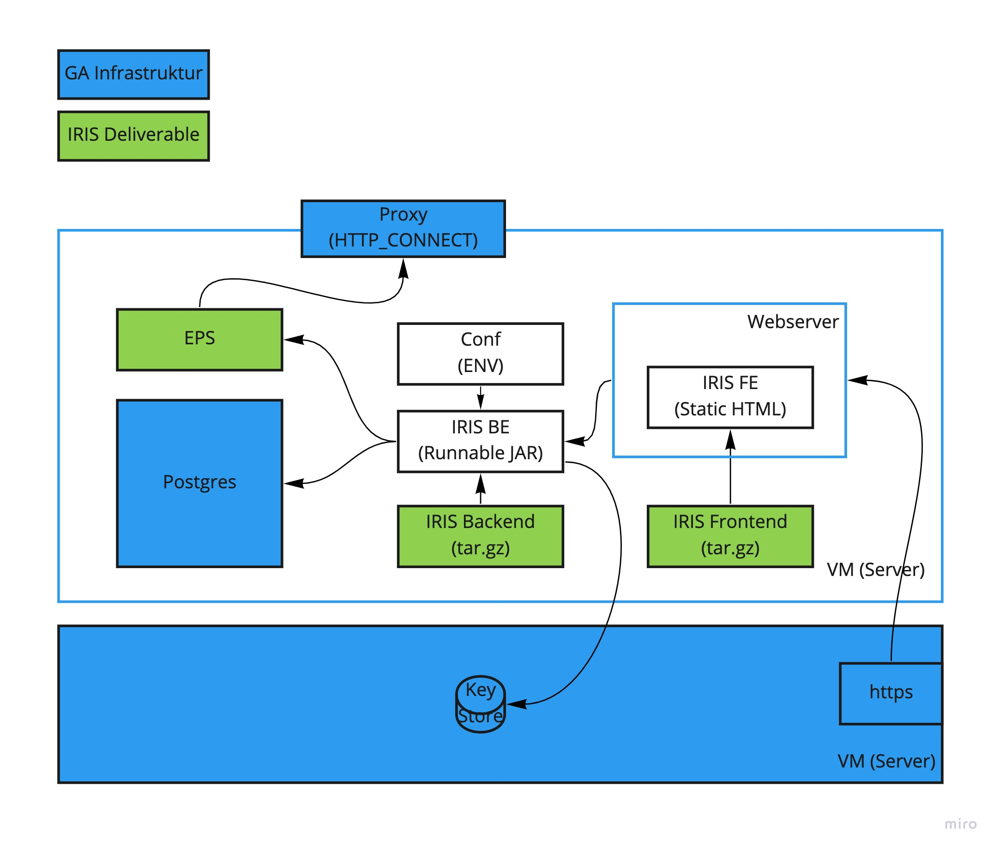

# IRIS Client - Stand-Alone Installation

Für diese Installationsart werden alle Komponenten des IRIS Clients separat auf einem Server installiert. Das folgende Schaubild visualisiert das Setup.



## Installation IRIS Backend (IRIS BE)

Bei dem IRIS Backend handelt es sich um eine Java Applikation (min Java 11).

1. Download Jar Datei

   ```
   https://github.com/iris-gateway/iris-client/releases
   ```

2. Anlegen einer Konfigurations Datei (Beispielwerte)

   ```
   > touch conf.env
   export SPRING_PROFILES_ACTIVE=prod

   export SPRING_DATASOURCE_USERNAME=iris
   export SPRING_DATASOURCE_PASSWORD=iris
   export SPRING_DATASOURCE_URL=jdbc:postgresql://localhost:5432/iris

   export SECURITY_JWT_JWT_SHARED_SECRET=foobar

   export SECURITY_AUTH_DB_ADMIN_USER_NAME=admin
   export SECURITY_AUTH_DB_ADMIN_USER_PASSWORD=admin
   ```

3. Konfigurations Parameter als Umgebungsvariablen exportieren

   ```
   source conf.env
   ```

4. Starten der Java Applikation (Beispiel Version: v1.0.3-alpha)

   ```
   java -jar iris-client-bff-v1.0.3-alpha.jar
   ```

