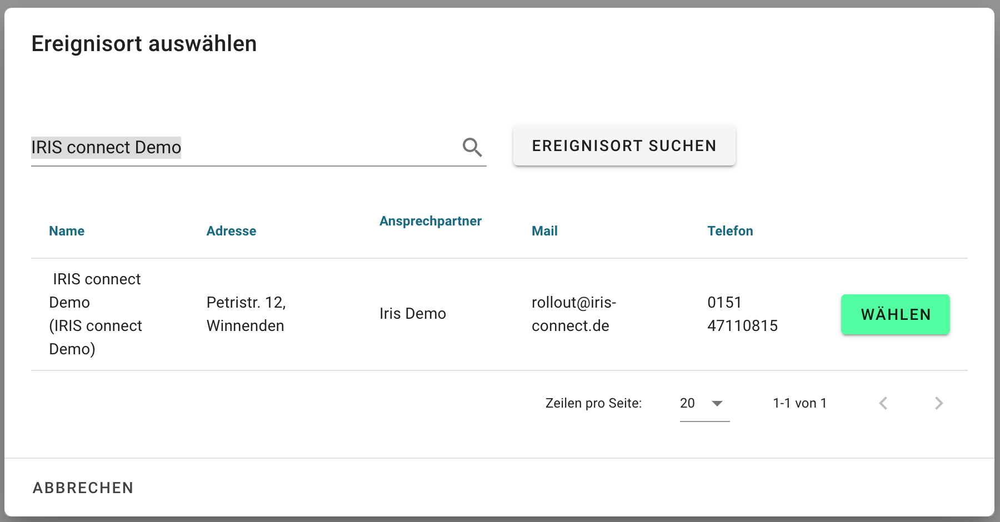

# Testen der Installation

Unabhängig von der Installationsvariante können Sie testen, ob die Installation erfolgreich war. Erfolgreich bedeutet, dass Ihre IRIS Client Installation mit den zentralen IRIS Services als auch mit den dezentralen Kontaktdaten Anbieter Apps kommunizieren kann. Die Zertifikate wurden korrekt konfiguriert. 

1. Öffnen Sie einen Browser und navigieren Sie zum IRIS Client (`IRIS_CLIENT_DOMAIN` aus der Konfiguration).

1. Melden Sie sich mit den initialen Admin Zugangsdaten an (`SECURITY_AUTH_DB_ADMIN_USER_NAME` und `SECURITY_AUTH_DB_ADMIN_USER_PASSWORD` aus der Konfiguration).

   

1. Navigieren Sie zu `Ereignisse` und klicken Sie dann auf `Neue Ereignisnachverfolgung starten`. 

   

1. Klicken Sie auf Ereignisort auswählen und suchen Sie nach `IRIS connect Demo`. Klicken Sie auf `Wählen`.

   

1. Füllen Sie die restlichen Anfrage Parameter aus. Sie können jeden beliebigen Zeitraum wählen. Klick Sie auf `Anfrage senden`.

   

1. Als Ergebnis können Sie die Gästelisten-Daten einsehen. 

   

Bei `IRIS connect Demo` handelt es sich um eine Test Lokation, die eigens für einen Smoketest zur Verfügung steht. Die Lokation liefert immer 3 fiktive Testdatensätze unabhängig vom angefragten Datum. 

Bei einem erfolgreichen Test haben Sie folgende Punkte sichergestellt. 

- [x] Ihre Installation kann mit IRIS kommunizieren.
- [x] Ihre Installation kann mit den App Anbietern kommunizieren.
- [x] Die Zertifikate sind richtig konfiguriert.

Sollte es bei dem Smoketest zu Problemen kommen, melden Sie sich bei `rollout@iris-connect.de`.